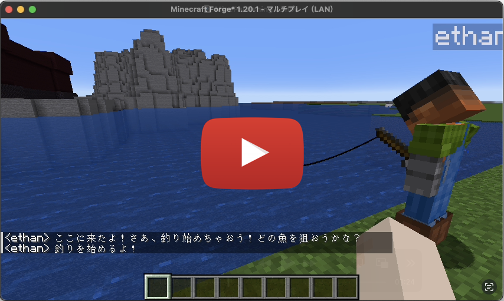
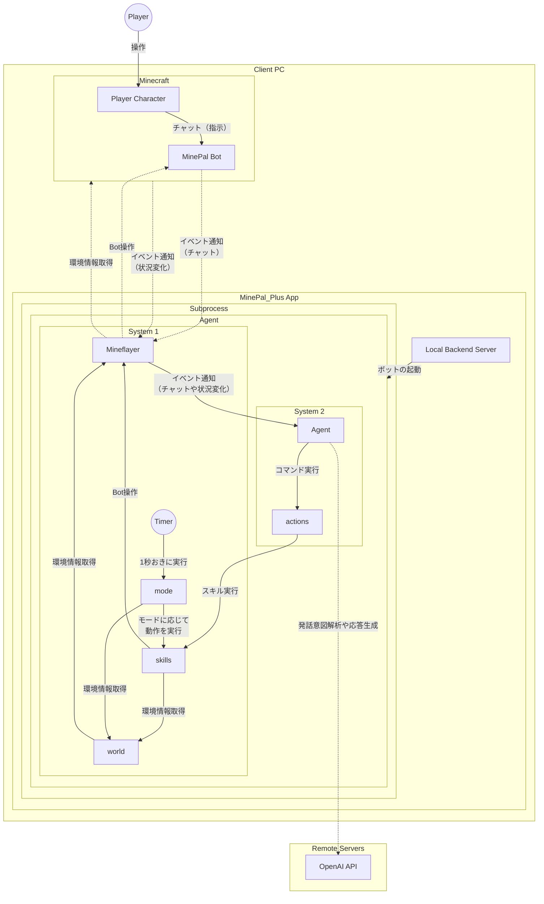
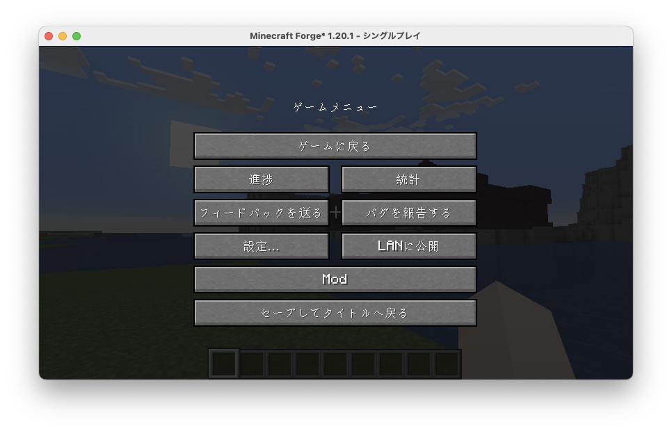
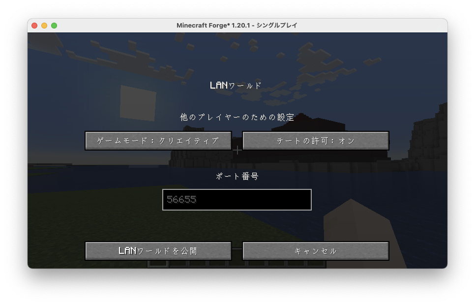
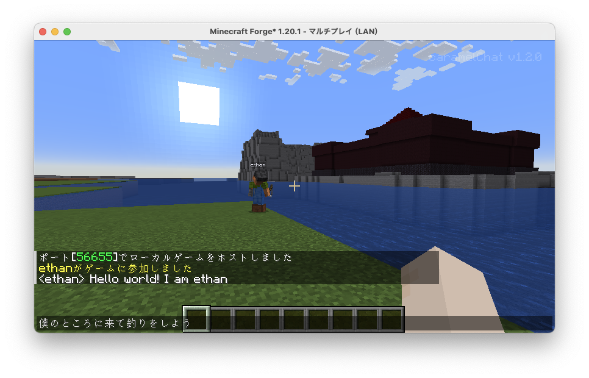
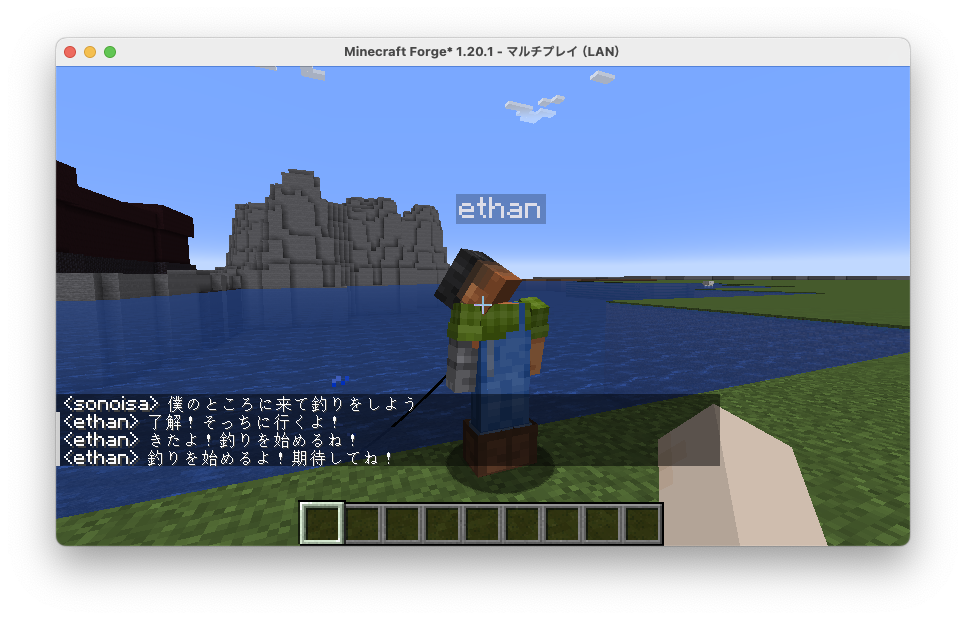
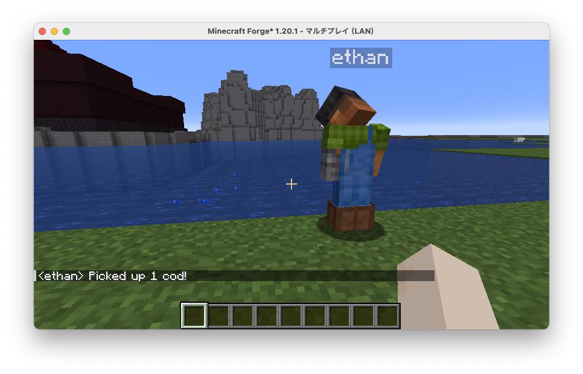

# MinePal

## 概要

MinePalは生成AIの頭脳を持ったMinecraftボット（自律エージェント）です。チャットで指示を出すと行動をしてくれたり、雑談に応じてくれたりします。
このリポジトリはleo4life2さんが作られたMinePalをベースに、シンプル化したり、バグを修正したり、釣りなどの能力を追加したりしたものです。  
（マルチモーダル対応にするためにElectronへの依存性を無くしました。）

- プレイヤーから誘われて、近くに来て釣りをするボットの動画：
[](https://youtu.be/PgIKDjIai84)

## システム構成



## MinePalアプリケーションの使い方

### 前提条件

- node.js v20（nvmなどを使ってバージョン指定でインストールするのが楽でしょう）
- node.jsの利用経験があり自分でトラブル対応できるくらいの知識があること。

### 準備

実行に必要な次のソフトウェアとAPI Keyを準備する。

1. [Minecraft Java Edition](https://www.minecraft.net/ja-jp/about-minecraft)
2. [OpenAI API](https://openai.com/index/openai-api/)のAPI Key（なお、MinePalで利用するデフォルトのモデルはgpt-4.1-miniとtext-embedding-3-small）
3. MinePal_Plusのソースコード（[Releases](https://github.com/sonoisa/MinePal_Plus)の上にあるCodeボタンを押し、Download ZIPを選び、ダウンロードし、ZIPファイルを解凍する）

### 設定

MinePal_PlusのソースコードのuserDataディレクトリにあるsettings.example.jsonをsettings.jsonという名前に変更して、次の項目を記載する。

- **openai_api_key**: 準備に記載したOpenAI API Key（sk-...という長い文字列であることが多い）
- **player_username**: Minecraftの自身のユーザー名  
   正しく設定しないとボットが指示を聞いてくれない。ユーザー名が不明な場合はMinecraft内で"t"を押してチャットウィンドウを開き、何かチャットをすると自身のユーザー名が表示される。
- **language**：ボットとのコミュニケーションに用いる言語（日本語の場合はja、英語の場合はen）
- **minecraft_version**：利用するMinecraftのバージョン。1.20.1で動作することは確認済み。他のバージョンでは動作しない可能性がある。
- **host**：MinePalアプリが動作するマシンから見たMinecraftサーバーのIPアドレス
- **port**：MinePalアプリが動作するマシンから見たMinecraftサーバーのポート番号  
   同一マシンで動いているのであればhostはlocalhostか127.0.0.1でよい。  
   ポート番号は後のステップに出てくる「LANに公開」で指定するポート番号と一致する必要がある。デフォルトは56655。

### ライブラリのインストール

MinePal_Plusのソースコードのディレクトリに移動し、次のコマンドを実行して必要なライブラリをインストールする。

```bash
npm install
```

### アプリケーションの起動

1. [Minecraft Java Edition](https://www.minecraft.net/ja-jp/about-minecraft)をバージョン指定で起動する。  
1.20.1で動作することは確認済み。他のバージョンでは動作しない可能性がある。

2. ボットがワールドに入って来れるようにLANワールドを公開する。  
Minecraftメニューを開いて「LANに公開」ボタンを押し、先ほどの設定のportの値を入力する。次に「LANワールドを公開」ボタンを押す。  
   - Minecraftメニュー：
      
   - LAN設定：
      

3. MinePal_Plusのソースコードのディレクトリに移動し、次のコマンドを実行して、MinePal_Plusを起動する。  

   ```bash
   node main.js
   ```
   正常に起動すれば次の画面のようにワールドにボットが現れる。  
   

   ログはMinePal_PlusのソースコードのuserDataディレクトリのapp.logやrunlogs/agent/logに出力される。正常に動作しない場合はこれらのログを確認するとよい。

### ボットとの対話

1. ボットがワールドに参加してきて「Hello World! I am ...」と挨拶をしてきたらボットの起動が完了したサインである。ここから対話が可能となる。サバイバルモードでは挨拶までに10秒程度かかることがある。

2. ボットに何か指示を出してみる。例えば「僕のところに来て釣りをしよう」とチャットで話しかけると、プレイヤーの近くに来て釣りを開始してくれる。
   - プレイヤーがチャットで話しかけ：
   
   - ボットがプレイヤーの近くに来て釣りを開始（内部では二つのコマンド!goToPlayerと!startFishingが実行されている）：
   
   - 何かが釣れると教えてくれ、プレイヤーが止めるまで釣りを継続：
   

   ボットに出せる指示を下記に示す。最新情報は[src/agent/commands/actions.js](https://github.com/sonoisa/MinePal/blob/main/src/agent/commands/actions.js)を参照してほしい。

   1. 移動
      - 指定したプレイヤーの元へ移動する。（内部コマンド：**!goToPlayer**）
      - 指定したプレイヤーの元へテレポートする。（内部コマンド：**!teleportToPlayer**）
      - 指定したプレイヤーを追尾し続ける。（内部コマンド：**!followPlayer**）
      - 現在地から指定した距離だけ離れた場所へ移動する。（内部コマンド：**!moveAway**）
      - 記憶している場所へ移動する。（内部コマンド：**!goToPlace**）
      - 指定した座標へ移動する。（内部コマンド：**!goToCoordinates**）
      - 最寄りのベッドに移動して寝る。（内部コマンド：**!goToBed**）
   2. ブロックを対象としたアクション
      - ボットの近くのブロックを取得する。（内部コマンド：**!nearbyBlocks**）
      - 指定したタイプのブロックを収集する。（内部コマンド：**!collectBlocks**）
      - 指定したタイプのブロックを収集し続ける。（内部コマンド：**!collectAllBlocks**）
      - 現在地に指定したブロックを設置する。（内部コマンド：**!placeHere**）
      - 指定した種類の最寄りのオブジェクトをアクティブにする。（内部コマンド：**!activateBlock**）
      - 近くの耕した土壌に種を植える。（内部コマンド：**!sow**）
      - 指定した種類の家を建築する。（内部コマンド：**!buildHouse**）
   3. エンティティを対象としたアクション
      - 指定した種類のエンティティを攻撃して倒す。（内部コマンド：**!attack**）
      - 指定した種類の最寄りのエンティティをアクティブにする。（内部コマンド：**!activateEntity**）
      - 指定したアイテムを指定したエンティティに使用する。（内部コマンド：**!useItemOnEntity**）
      - 現在乗っているエンティティから降りる。（内部コマンド：**!dismount**）
   4. インベントリやチェストやクラフト台などを対象としたアクション
      - 指定したアイテムをプレイヤーに渡す。（内部コマンド：**!givePlayer**）
      - 指定したレシピでアイテムを一定個作成する。（内部コマンド：**!craftRecipe**）
      - 最寄りのチェストにアイテムを預ける。（内部コマンド：**!depositToChest**）
      - 最寄りのチェストからアイテムを引き出す。（内部コマンド：**!withdrawFromChest**）
      - 最寄りのチェストを確認し、その内容を記録する。（内部コマンド：**!lookInChest**）
      - 指定したアイテムを一定個精錬する。（内部コマンド：**!smeltItem**）
      - 最寄りのかまどを確認し、その内容を記録する。（内部コマンド：**!lookInFurnace**）
      - 最寄りのかまどからアイテムを取り出す。（内部コマンド：**!takeFromFurnace**）
   5. ボット自身を対象としたアクション
      - 指定したアイテムを指定した体の部位に装備する。（内部コマンド：**!equip**）
      - 食べ物や飲み物を消費する。（内部コマンド：**!consume**）
      - しゃがむ（スニーク）状態になる。（内部コマンド：**!startCrouching**）
      - しゃがみを解除する。（内部コマンド：**!stopCrouching**）
      - 実行中のすべてのアクションやコマンドを強制終了する。（内部コマンド：**!stop**）
      - 現在地に留まり続ける。すべてのモードを一時停止する。（内部コマンド：**!stay**）
      - 現在持っているアイテムを使用する。（内部コマンド：**!activateItem**）
      - 釣りを開始する。（内部コマンド：**!startFishing**）
      - 釣りを終了する。（内部コマンド：**!stopFishing**）
   6. 記憶
      - 現在地を指定した名前で記憶する。（内部コマンド：**!rememberHere**）
      - 記憶した場所の名前を変更する。（内部コマンド：**!renamePlace**）
      - 場所の記憶を削除する。（内部コマンド：**!deletePlace**）
